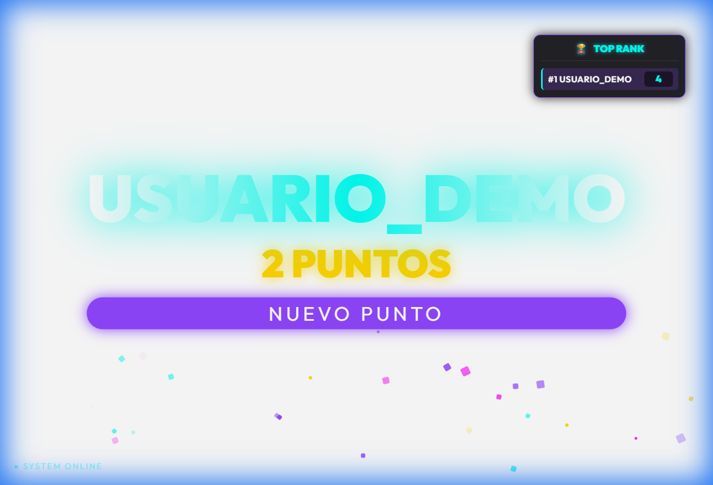
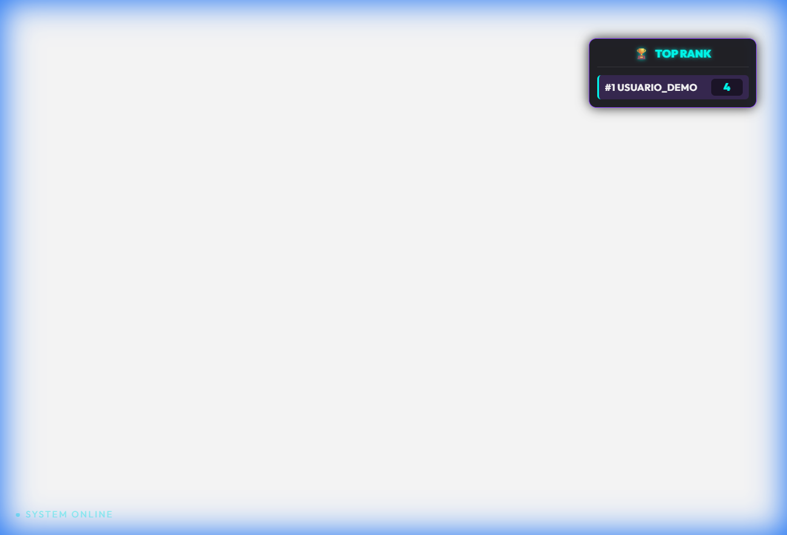

# 🏆 Professional Twitch Rank Overlay System

Este es un sistema de gamificación para streamers de Twitch, diseñado para aumentar la interactividad del chat mediante un marcador visual dinámico y animaciones en tiempo real.

## 🎬 Vista Previa del Sistema

| Animación de Ganador | Tabla de Posiciones |
| :---: | :---: |
|  |  |

*(Las capturas muestran el sistema activo con efectos de confeti y el diseño ultra-compacto)*

## 🚀 Características Principales

- **Dashboard Visual eSports**: Overlay minimalista con estética de neón y tipografía moderna (Outfit Google Font).
- **Animaciones en Tiempo Real**: Efectos de confeti y anuncios gigantes de ganadores mediante WebSockets/Polling.
- **Sistema Multi-canal**: Capacidad para gestionar múltiples canales de Twitch de forma simultánea e independiente.
- **Drag & Drop Interactivo**: Los streamers pueden posicionar los elementos del overlay con el mouse directamente en OBS.
- **Persistencia Local**: Guarda las posiciones personalizadas por cada canal automáticamente.
- **Seguridad**: Comandos restringidos exclusivamente a moderadores y broadcasters.

## 🛠️ Stack Tecnológico

- **Backend**: Node.js, Express.
- **Twitch Integration**: TMI.js (Twitch Messaging Interface).
- **Frontend**: HTML5 Semántico, CSS3 (Flexbox/Grid), Vanilla JavaScript (ES6+).
- **Animaciones**: CSS Keyframes y DOM Manipulation.

## 📋 Comandos del Bot

- `!rank <nombre>`: Incrementa el puntaje y dispara la animación visual.
- `!corregir <nombre>`: Resta un punto en caso de error.
- `!marcador`: Despliega el ranking actual en el chat.
- `!resetmarcador`: Reinicia la competición para una nueva ronda.

## 🔧 Configuración Técnica

El sistema está diseñado para ser desplegado en plataformas como **Render**, **Heroku** o en servidores locales.

1. Clonar el repositorio.
2. Ejecutar `npm install`.
3. Configurar variables de entorno (`.env`):
   - `TWITCH_USERNAME`: Usuario del bot.
   - `TWITCH_OAUTH_TOKEN`: Token de acceso.
   - `STREAMER_CHANNEL`: Canales donde operará el sistema.

---
*Desarrollado para la comunidad de streaming, enfocado en performance y estética visual.*
